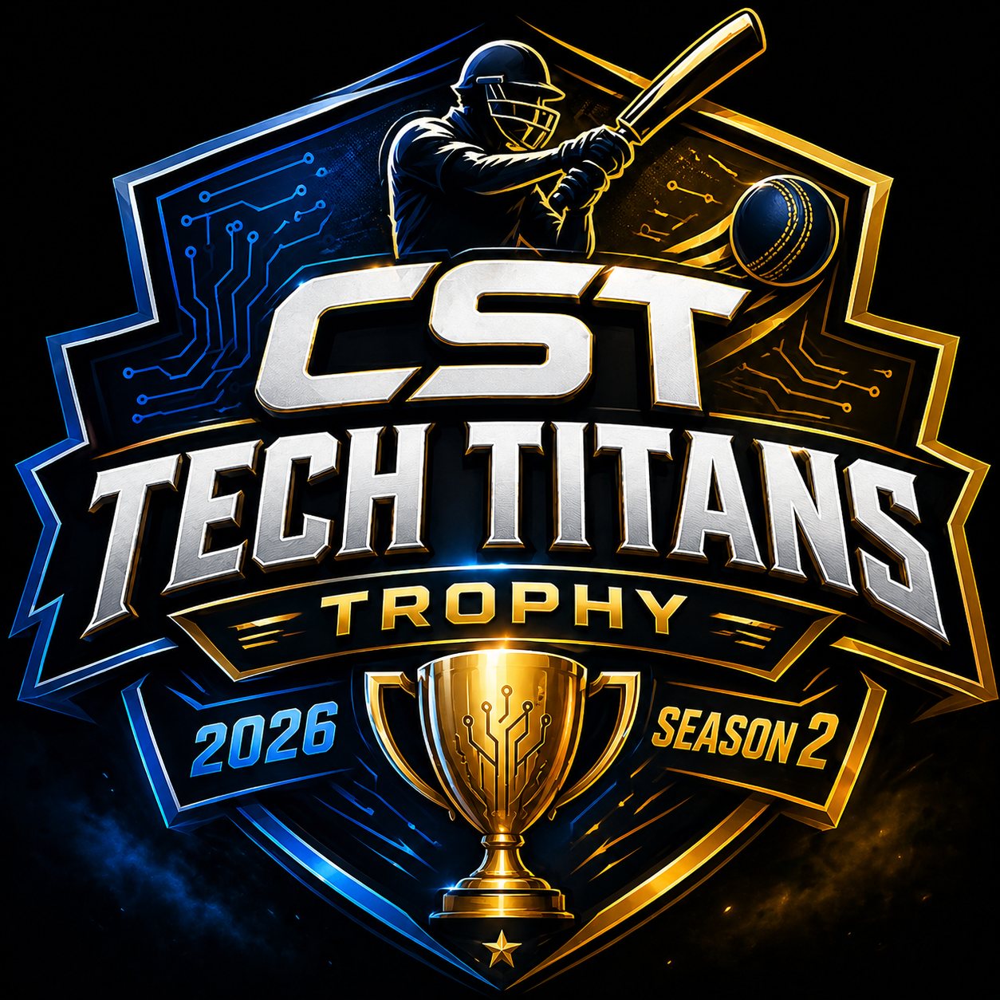
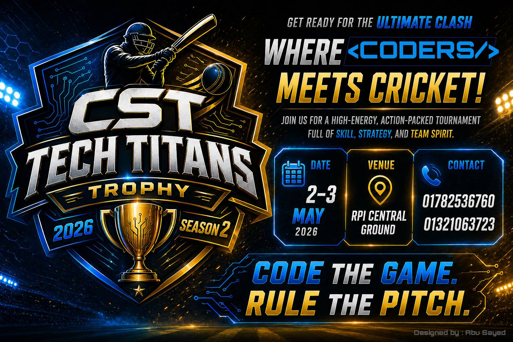
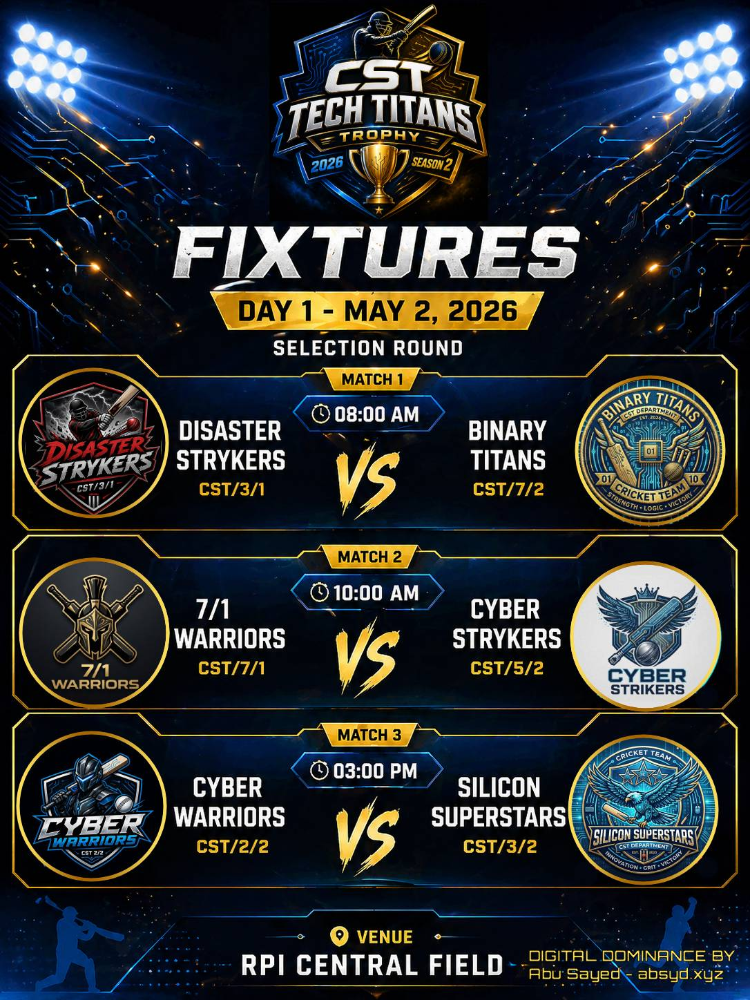
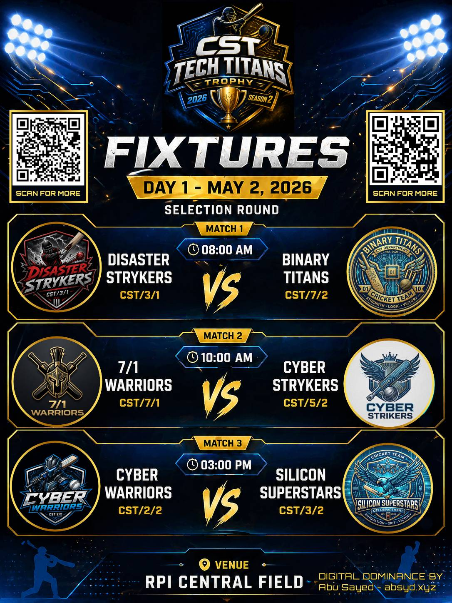

# CST Tech Titans Trophy Archive



A digital archive preserving the CST Tech Titans Tournament — an esports/coding competition featuring teams, match schedules, standings, and news.

## About

This repository contains:

- **Web Archive** (`cst3_web/`) — A React + Vite web application showcasing tournament information
- **Media Assets** — Tournament banners, fixtures, logos, and event footage

## Web Archive

The web application is built with:
- React 19 + React Router
- Vite for build tooling
- Tailwind CSS for styling

### Pages
- **Home** — Tournament overview and highlights
- **Teams** — Participating teams
- **Schedule** — Match fixtures and timing
- **Standings** — Tournament rankings
- **News** — Event updates and announcements
- **Rules** — Competition regulations

### Run Locally

```bash
cd cst3_web
npm install
npm run dev
```

### Build

```bash
npm run build
```

## Repository Structure

```
.
├── cst3_web/          # React web application
│   ├── src/
│   │   ├── components/
│   │   ├── pages/
│   │   └── data/
│   ├── public/
│   └── ...
├── *.png, *.jpg       # Tournament banners and fixtures
├── *.mp4              # Event footage
└── README.md
```

## Media Contents



- `final-banner-coder.jpg` — Finals banner (shown above)
- `final-logo.png` — Tournament logo
- `fixture_*.png/jpg` — Match fixtures
- `jersy.jpg` — Team jerseys
- `WhatsApp Video 2026-04-29 at 22.51.11.mp4` — Event recording

### Fixture Examples





## Tech Stack

- **Frontend**: React, React Router, Tailwind CSS
- **Build Tool**: Vite
- **Linting**: ESLint
- **Deployment**: Vercel (configured)

## License

This archive is preserved for historical reference of the CST Tech Titans Tournament.